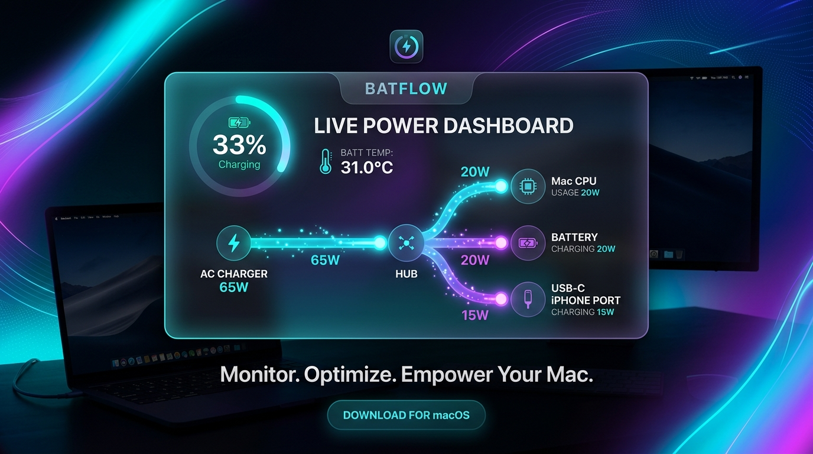

<div align="center">

# ⚡️ BatFlow

### Next-Generation Power Flow Telemetry & Battery Monitor for macOS

[](https://www.apple.com/macos)
[](https://swift.org)
[](LICENSE)
[](https://github.com/your-username/BatFlow/releases)

<p align="center">
  
</p>

</div>

---

## 💡 Overview

**BatFlow** is an open-source, lightweight native macOS menu bar application designed to replace legacy tools like BatFi on modern macOS (macOS 14, 15, 16, 27+). 

Built with Swift, SwiftUI, and low-level IOKit & Apple SMC interfaces, BatFlow provides real-time power distribution breakdown, Apple Silicon SMC battery temperature sensing, USB-C output port wattage inspection, and historical telemetry charts.

> [!NOTE]
> **Why BatFlow?**
> Recent macOS releases (macOS 15+ / macOS 27) include native system battery charge management (such as the 80% charging limit). **BatFlow intentionally focuses on deep observability and rich visual telemetry**—such as real-time power flow node graphs, per-port USB-C wattage inspection, and SMC thermal monitoring—without interfering with macOS system power management routines.

---

## ✨ Features

- ⚡️ **Real-Time Charge Flow Graph (Node Diagram)**:
  Visualizes power distribution live in an animated node diagram:
  $$\text{Charger Input (65W)} \longrightarrow \begin{cases} \text{Mac / CPU Usage (20W)} \\ \text{Battery Charge (+20W)} \\ \text{USB-C Output Ports (15W)} \end{cases}$$
- 🌡 **Precision SMC Battery Temperature**:
  Reads Apple Silicon SMC float sensors (`TB0T`, `TB1T`, `TB2T`) for exact battery temperature in °C and °F.
- 🔌 **USB-C Output Ports Wattage Inspector**:
  Reports real-time wattage (W), voltage (V), current (A), and connection state for each connected external device (e.g. charging an iPhone, iPad, or external accessory from your Mac).
- 📊 **Rolling Telemetry Charts**:
  Tracks historical power draw (Mac W, Battery W, Output W) and Battery % / Temperature over time using native Swift Charts.
- ⚙️ **Customizable Status Bar Item**:
  Customize your menu bar format (`⚡️ 33% • 31.0°C • 65W`, compact, or percentage only), polling interval, and temperature unit.
- 🚀 **Zero Dependencies & Low Resource Footprint**:
  Written natively in Swift with 0 third-party packages. Light on CPU and memory.

---

## 🛠 Technology & Architecture

BatFlow uses native macOS hardware frameworks:
- **`AppleSmartBattery` (IOKit)**: Retrieves state of charge (%), raw voltage (mV), amperage (mA), nominal vs actual charger wattage, health %, cycle count, and `PowerOutDetails` (per-port output wattages).
- **`AppleSMC`**: Interrogates SMC float keys directly (`TB0T`, `TB1T`, `TB2T`) for hardware thermal telemetry and system power (`PSTR`).
- **SwiftUI & Swift Charts**: Renders modern glassmorphic popover UI with fluidAnimations.

---

## 📦 Installation & Quick Start

### Download Pre-built Release
Download the latest `BatFlow-macOS.zip` from the [GitHub Releases](https://github.com/your-username/BatFlow/releases) page, unzip, and launch `BatFlow.app`.

### Build from Source

Requirements: macOS 14.0+, Xcode 15+ / Command Line Tools.

```bash
# Clone the repository
git clone https://github.com/your-username/BatFlow.git
cd BatFlow

# Build executable directly with swiftc
swiftc -module-cache-path /tmp/swift_cache \
  -framework IOKit -framework AppKit -framework SwiftUI -framework Charts \
  -parse-as-library \
  -o BatFlow \
  Sources/BatFlow/*.swift

# Package into app bundle & sign
mkdir -p BatFlow.app/Contents/MacOS BatFlow.app/Contents/Resources
cp BatFlow BatFlow.app/Contents/MacOS/BatFlow
cp Info.plist BatFlow.app/Contents/Info.plist
codesign -s - --force --deep BatFlow.app

# Launch BatFlow
open BatFlow.app
```

---

## 🚀 GitHub Actions CI/CD Workflow

Every merge or push to `main` (or tag `v*`) automatically triggers `.github/workflows/release.yml` which builds `BatFlow.app`, packages `BatFlow-macOS.zip`, and creates an automated GitHub Release.

---

## 📄 License

BatFlow is open-source software licensed under the [MIT License](LICENSE).
